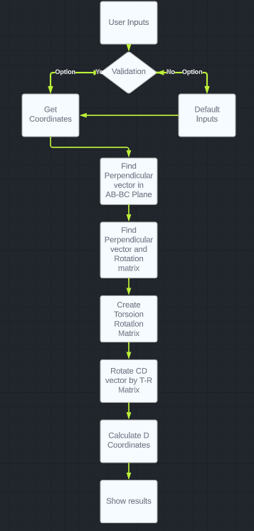
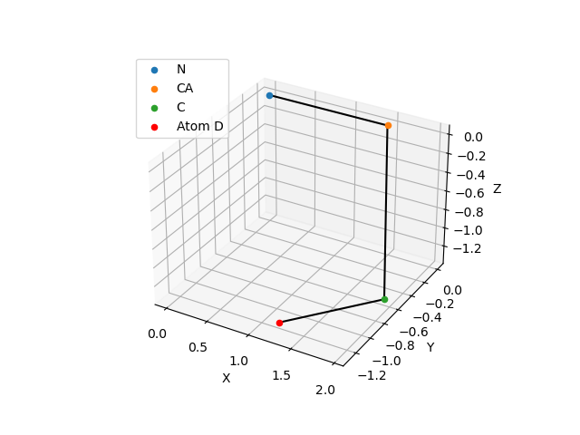

# BMSID_Mol
 ## Name: Aakash Reddy Gorla
 ### Roll No: 2020102034

This jupyter notebook lets you calculate the position of the 4th atom in a molecule given the first 3 atoms' positions, bond lengths and torsion angles.

Click run in the jupyter notebook to run the code. You can change the values of the bond lengths and torsion angles to see how the position of the 4th atom changes.
The first 3 atoms can also be changed and selected from a list of atoms.

A 3-D plot of the molecule is also displayed.

Flowchart:  

Example:  

Link to drive: https://drive.google.com/file/d/1Dlqdf5oxeXXQNIUPa29V2wWbxxHi1o15/view?usp=drive_link